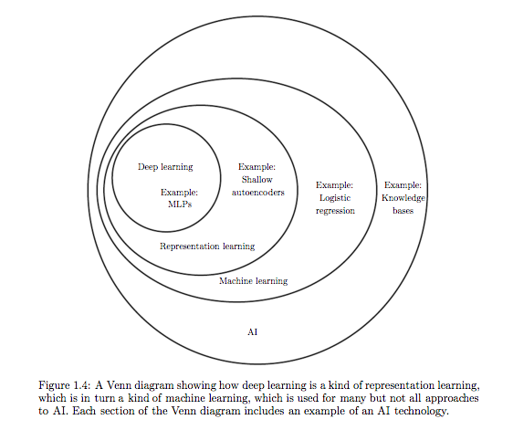

# Teaching Material

This directory contains material that is intended for curriculum developers and instructors. Students may read this content as well but it should be noted that a deeper familiarity with Machine Learning and Python is expected in this content.

## Curriculum Philosophy

Before we break down the curriculum, exercises, and course material in detail, it is helpful to discuss the philosophy and strategy around the instruction of this content.

### Learning Objectives

The students should end the week with a high-level understanding of how the field of artificial intelligence has developed over time from rule-based systems, to more classical machine learning algorithms, to representation learning, to deep learning. Furthermore, the students should gain an intuition regarding when the different classes of algorithms could be used based on the data that one has to train with. For example, if you have a very straightforward prediction to make and extracting a suitable representation of the data is sufficiently simple, a linear regression may solve your problem quite efficiently. However, for a large (and growing) class of problems, the representation may be more challenging to establish so a deep learning approach may be necessary.

One may have an initial reaction that deep learning is too advanced of a topic to teach high school students but I think this is incorrect. In the book [*Deep Learning*](https://www.deeplearningbook.org/) by Goodfellow et al, the authors present a case for deep learning that is quite compelling. The sentiment they express in the introduction of the book is roughly paraphrased here:

> *The performance of simple machine learning algorithms depends heavily on the representation of the data they are given. For example, when logistic regression is used to recommend cesarean delivery, the AI system does not examine the patient directly. Instead, the doctor tells the system several pieces of relevant information, such as the presence or absence of a uterine scar. Each piece of information included in the representation of the patient is known as a feature. Logistic regression learns how each of these features of the patient correlates with various outcomes. However, it cannot influence how features are defined in any way. If logistic regression were given an MRI scan of the patient, rather than the doctor’s formalized report, it would not be able to make useful predictions. Individual pixels in an MRI scan have negligible correlation with any complications that might occur during delivery.*
>
> *This dependence on representations is a general phenomenon that appears throughout computer science and even daily life. In computer science, operations such as searching a collection of data can proceed exponentially faster if the collection is structured and indexed intelligently. People can easily perform arithmetic on Arabic numerals but find arithmetic on Roman numerals much more time consuming. It is not surprising that the choice of representation has an enormous effect on the performance of machine learning algorithms.*
>
> *Many artificial intelligence tasks can be solved by designing the right set of features to extract for that task, then providing these features to a simple machine learning algorithm. However, for many tasks, it is difficult to know what features should be extracted. For example, suppose that we would like to write a program to detect cars in photographs. We know that cars have wheels, so we might like to use the presence of a wheel as a feature. Unfortunately, it is difficult to describe exactly what a wheel looks like in terms of pixel values. A wheel has a simple geometric shape but its image may be complicated by shadows falling on the wheel, the sun glaring off the metal parts of the wheel, the fender of the car or an object in the foreground obscuring part of the wheel, and so on.*
>
> *One solution to this problem is to use machine learning to discover not only the mapping from representation to output but also the representation itself. This approach is known as **representation learning**. Learned representations often result in much better performance than can be obtained with hand-designed representations. They also allow AI systems to rapidly adapt to new tasks, with minimal human intervention.*
>
> *Of course, it can be very difficult to extract such high-level, abstract features from raw data. **Deep learning** solves this central problem in representation learning by introducing representations that are expressed in terms of other, simpler representations. Deep learning allows the computer to build complex concepts out of simpler concepts.*

This excerpt, while not simple or succinct enough for high school students, contains the sentiment that the students should understand by the end of the course. This progression of AI is also excellently visualized in the *Deep Learning* textbook as follows:

### Intuition vs Mathematical Understanding

For topics that are sufficiently quantitative, there are often two levels of understanding that a person must go through to deeply understand a topic. First, it is useful to develop an *intuition* for the topic. For example, to develop an intuition for gradient descent, one may reason about a three-dimensional plane and trying to find the minimum. Once this intuition is achieved, one may be compelled to ask several excellent questions like "what about local minima?".

Once some intuition is attained, the next level of understanding is a rigorous mathematical understanding. For the above example, one would need to acquire a mathematical understanding of gradient descent and backpropagation. This mathematical understanding always compliments an intuition. In most cases, understanding the mathematics behind a machine learning objective helps develop a deeper, more accurate intuition as well.

For this course, we should focus on helping the students develop an intuition for these topics but not a mathematical understanding. Advanced students may wish to pursue a mathematical understanding after the course, but deeply understanding the mathematics is not the most impactful use of the limited time we have.

### Lesson Plan

In previous years, we have spent the first two days teaching students Python, the next two days teaching students introductory Machine Learning, and the final day working with the students on a capstone project. For this year, I propose spending the first four days working through a more combined approach where we progressively teach the students about Machine Learning with exercises that are done in Python. This allows a longer exposure to both Python and Machine Learning while also contextualizing the Python examples to real-world examples. The final day can then be spent on a more thorough capstone project which takes advantage of the latest knowledge that the students have learned (for example: fashion MNIST).

A high-level distribution of course content may be:

- Day 1: Rule-Based Systems
- Day 2: Classical Machine Learning
- Day 3: Representation Learning & Deep Learning
- Day 4: Deep Learning
- Day 5: Capstone Project

Again, note that each day should include both lesson-based instruction as well as Python-based exercises. It should also be noted that learning how to program in Python is not the goal of the exercises, the goal of the exercises is to internalize an intuition on what kinds of problems can be solved with which approaches.
